# GxP Document Pipeline Infrastructure

A production-grade, GxP-compliant AI document generation platform built on AWS EKS — mirroring the infrastructure requirements of regulated life sciences software.

> Built to demonstrate operational readiness for DevOps/Platform Engineering roles at companies deploying AI in regulated environments.

---

## The Problem This Solves

Life sciences companies like pharma and medical device manufacturers must generate thousands of regulatory documents — INDs, NDAs, Design History Files, Clinical Trial protocols — across the entire product lifecycle. These documents must be:

- **Accurate** — wrong data in an FDA submission causes rejection
- **Auditable** — every change must be traceable to a person and timestamp
- **Reliable** — a pipeline outage during an FDA submission deadline is catastrophic
- **Secure** — patient data and proprietary drug information cannot be exposed

This project builds the infrastructure layer that makes AI document generation trustworthy in a regulated environment.

---

## Architecture
GitHub Repository

|

v

ArgoCD (GitOps) --> Detects changes --> Deploys to EKS

|

v

AWS EKS Cluster (us-west-2)

|-- Namespace: gxp-doc

|   |-- doc-generator (2 replicas) --> AWS Secrets Manager

|   |-- RBAC Roles (least privilege)

|   -- ServiceAccount (IRSA -> IAM Role) |-- Namespace: monitoring |   |-- Prometheus (metrics collection) |   |-- Grafana (SLO dashboards) |   -- Alertmanager (alert routing)

-- Namespace: argocd     -- ArgoCD (GitOps controller)
AWS Infrastructure (Terraform)

|-- VPC (10.0.0.0/16)

|   |-- Private Subnets (EKS nodes) - us-west-2a, us-west-2b

|   -- Public Subnets (Load balancers) - us-west-2a, us-west-2b |-- EKS Cluster (Kubernetes 1.32) |-- KMS Key (auto-rotation enabled) |-- ECR Repository (image scanning enabled) -- Secrets Manager (API keys, credentials)

---

## Tech Stack

| Layer | Technology |
|---|---|
| Cloud | AWS (EKS, ECR, Secrets Manager, KMS, IAM) |
| Infrastructure as Code | Terraform |
| Container Orchestration | Kubernetes 1.32 |
| GitOps | ArgoCD |
| Package Management | Helm |
| Application | Python, FastAPI |
| AI | Anthropic Claude API |
| Observability | Prometheus, Grafana, Alertmanager |
| Security | RBAC, IRSA, KMS encryption, non-root containers |
| Compliance | GxP, FDA 21 CFR Part 11 audit trail |

---

## GxP Compliance Features

**Audit Trail**
Every document generation request is logged with: who requested it, what they requested, when, from which IP, how long it took, and whether it succeeded. Audit records cannot be deleted — enforced at the database level via PostgreSQL trigger.

**Secrets Management**
API keys and credentials are never hardcoded or stored in environment variables. All secrets are fetched at runtime from AWS Secrets Manager via IRSA — pod-level IAM authentication without shared credentials.

**Immutable Image Tags**
Every Docker image gets a unique version tag. Images are never overwritten — v1.0.0 always refers to the same code. Required for GxP traceability.

**RBAC — Least Privilege**
Three roles defined: doc-generator-role (service, minimal access), audit-reader-role (compliance auditors, read-only), developer-role (engineers, namespace-scoped). No role has more permissions than needed.

**GitOps — Validated Deployments**
Every deployment is tied to a Git commit. ArgoCD selfHeal means manual changes to the cluster are automatically reverted — the Git repository is always the source of truth.

**Encryption**
KMS key with automatic rotation encrypts all cluster secrets. ECR images are encrypted at rest with AES-256. All database connections require SSL.

**Non-Root Containers**
All containers run as a dedicated non-root user (gxpuser). Enforced at both the Dockerfile level and Kubernetes securityContext.

---

## Service Level Objectives (SLOs)

| SLO | Target | Impact if Breached |
|---|---|---|
| Document generation success rate | >= 99.5% | FDA submission failures |
| API latency P99 | < 500ms | Blocked regulated workflows |
| Pod availability | >= 99% | Reduced generation capacity |
| Deployment success rate | >= 99% | Delayed bug fixes and features |

---

## Project Structure
gxp-doc-pipeline/

|-- terraform/

|   |-- modules/

|   |   |-- vpc/          # VPC, subnets, NAT gateway

|   |   |-- eks/          # EKS cluster, node groups

|   |   |-- rds/          # PostgreSQL for audit logs

|   |   -- secrets/      # Secrets Manager configuration |   -- environments/

|       -- prod/         # Production environment config |-- k8s/ |   -- base/             # Kubernetes manifests (ArgoCD deploys these)

|       |-- namespace.yaml

|       |-- deployment.yaml

|       |-- service.yaml

|       |-- serviceaccount.yaml

|       -- rbac.yaml |-- argocd/ |   -- application.yaml  # ArgoCD application config

|-- services/

|   -- doc-generator/    # FastAPI document generation service |       |-- main.py |       |-- requirements.txt |       -- Dockerfile

|-- observability/

|   |-- prometheus/       # ServiceMonitor, SLO definitions

|   -- grafana/          # Dashboard configurations |-- compliance/ |   -- audit-logger/     # GxP audit trail schema and logger

|-- runbooks/             # Operational incident response

|   |-- 01-document-generation-down.md

|   |-- 02-secrets-rotation-failure.md

|   -- 03-argocd-deployment-failure.md |-- docs/ |   -- postmortem-001.md # Real incident postmortem

`-- screenshots/          # Project proof screenshots

---

## Infrastructure

### VPC and Networking
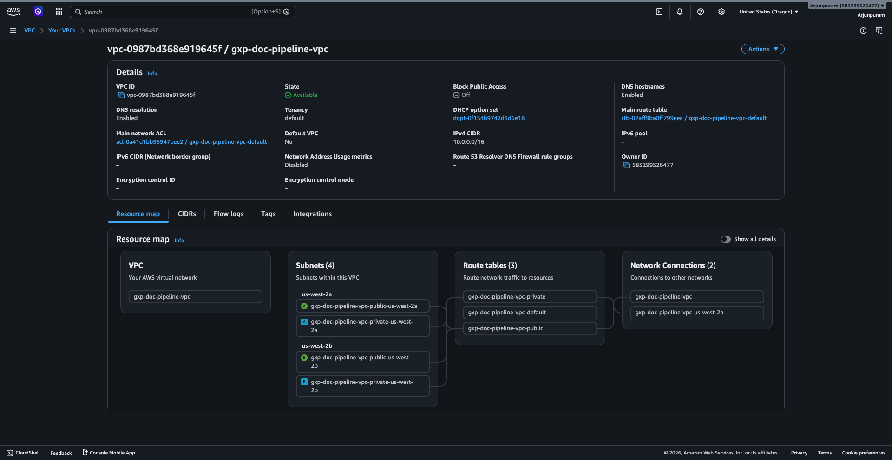

Private subnets host EKS worker nodes — no direct internet access. Public subnets host load balancers only. NAT Gateway provides secure outbound internet access. Deployed across two availability zones for high availability.

### EKS Cluster
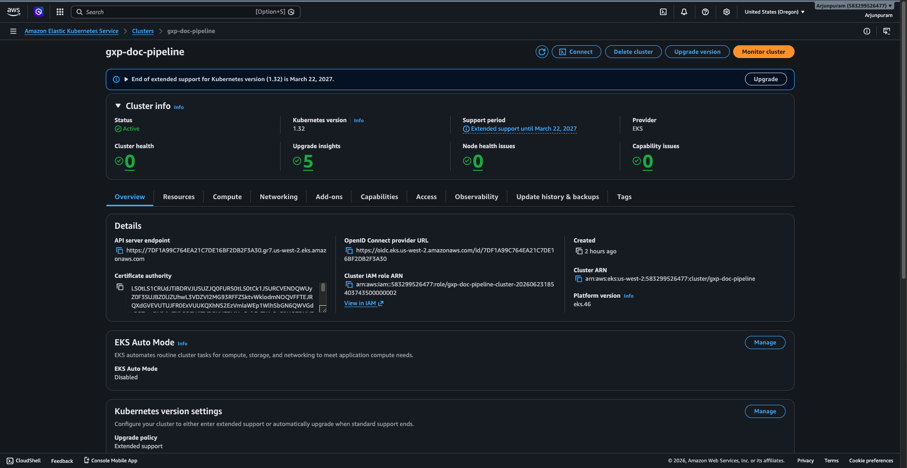

Kubernetes 1.32 on AWS EKS. Two t3.medium worker nodes across us-west-2a and us-west-2b.

### Worker Nodes Ready
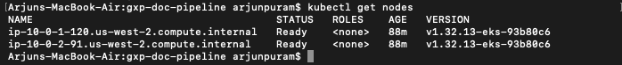

Both nodes confirmed Ready via kubectl. Nodes live in private subnets — not directly accessible from the internet.

### Terraform Infrastructure Outputs
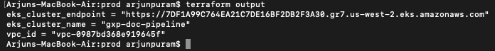

Live infrastructure values output by Terraform — VPC ID, EKS cluster name, and API endpoint.

### KMS Encryption
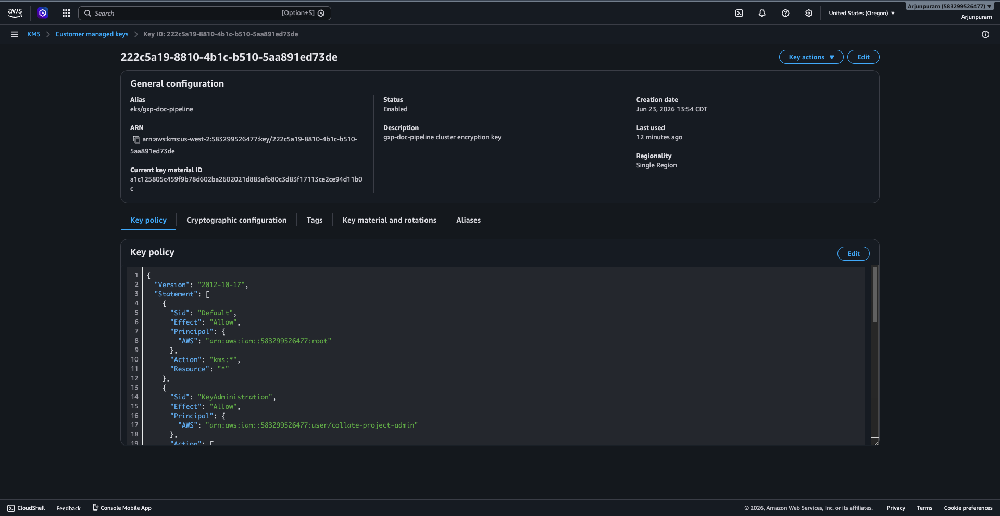

Customer-managed KMS key with automatic rotation encrypts all EKS cluster secrets.

---

## GitOps with ArgoCD

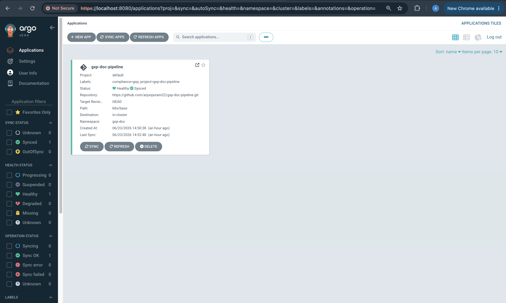

ArgoCD watches the GitHub repository and automatically deploys any changes to the cluster. Every deployment is tied to a Git commit — complete, auditable deployment history.

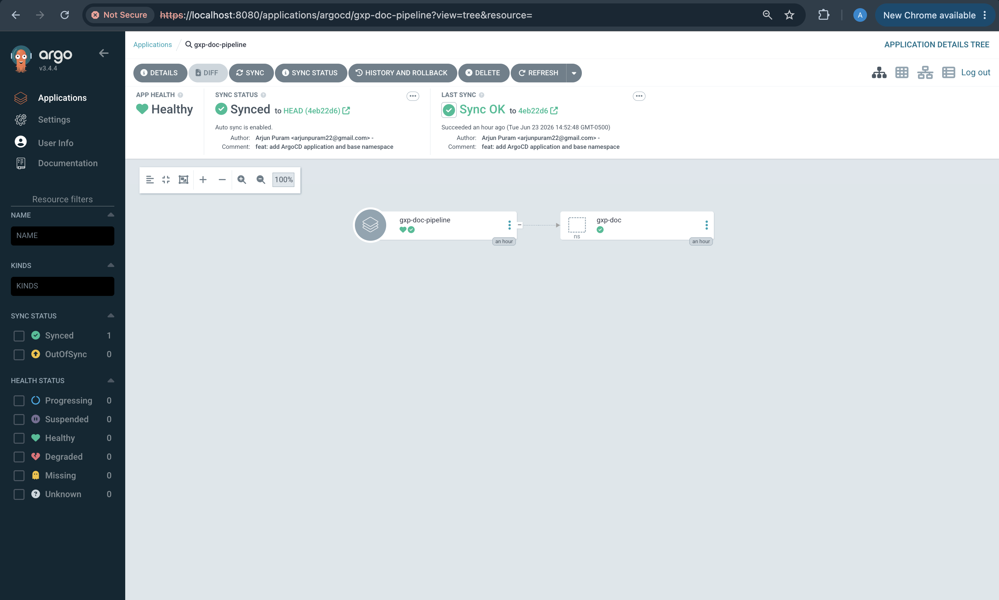

selfHeal means any manual change to the cluster is automatically reverted within minutes. Git is always the source of truth — a core GxP requirement.

---

## Docker Image in ECR

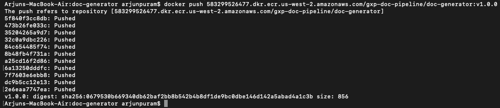

Docker image built for linux/amd64, scanned for vulnerabilities on push, and encrypted at rest with AES-256.

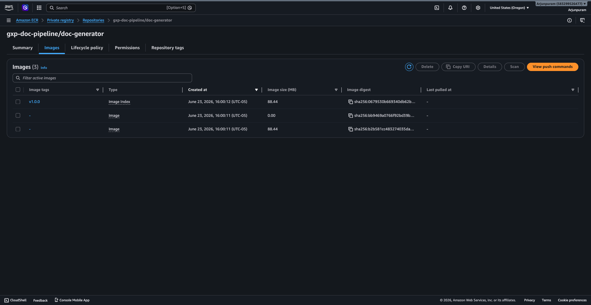

Immutable image tags — v1.0.0 and v1.0.1 both preserved. Every code change gets a new version tag, never overwriting existing images.

---

## AI Document Generation Service

FastAPI service running inside Kubernetes accepts document generation requests, fetches the API key securely from AWS Secrets Manager, calls Claude AI, and returns a GxP-compliant regulatory document with a full audit log entry.

### Health Check
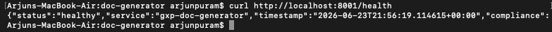

Every response includes compliance: gxp — Kubernetes uses this endpoint for liveness and readiness probes.

### Live IND Application Generated
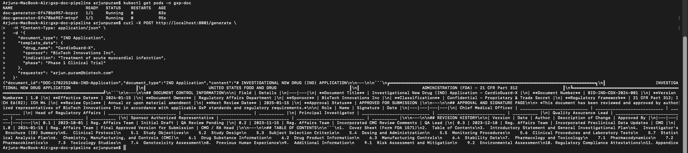

A real FDA Investigational New Drug (IND) Application generated by Claude AI — including document control table, approval signature page, revision history, and all required regulatory sections under FDA 21 CFR Part 312.

### Kubernetes Pods Running
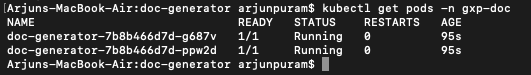

Two replicas running across two nodes — if one node fails, the other continues serving requests.

---

## Secrets Management

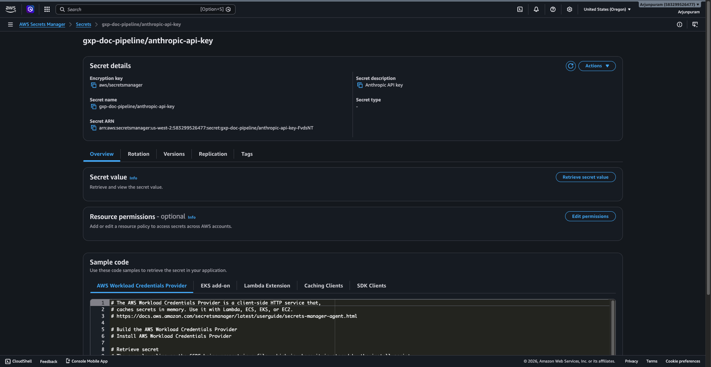

The Anthropic API key lives in AWS Secrets Manager — encrypted, access-controlled by IAM, never visible in code, environment variables, or Kubernetes manifests. Fetched at pod startup via IRSA.

---

## RBAC

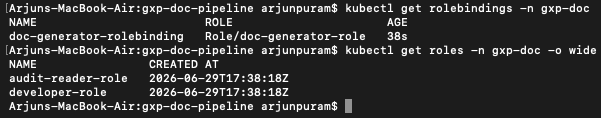

Three roles enforce least privilege. The document generation service cannot read Kubernetes secrets — its only credential source is AWS Secrets Manager. Compliance auditors get read-only access. Developers are scoped to the gxp-doc namespace only.

---

## Observability

### Prometheus — Active Target Scraping
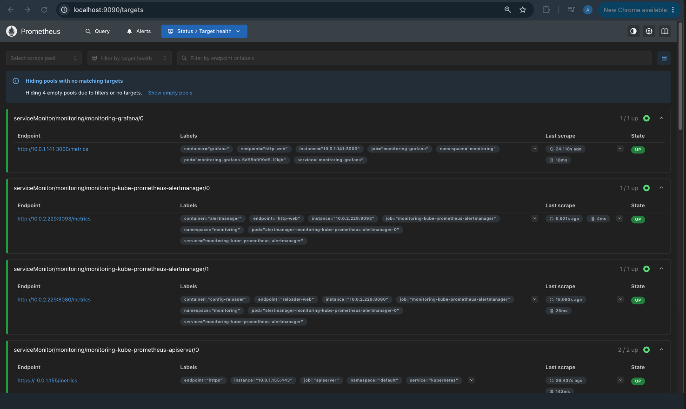

Prometheus scrapes metrics from every component every 15 seconds — Grafana, Alertmanager, Kubernetes API server, node exporters, and the document generation service.

### Grafana — Real-Time Pod Metrics
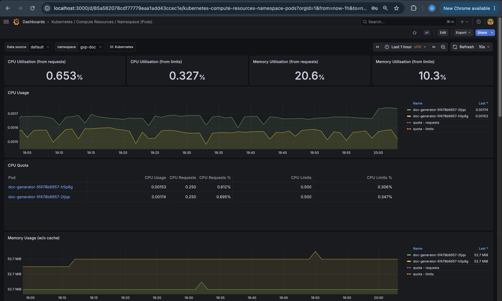

Live CPU and memory metrics for both document generation pods. SLOs tracked: success rate >= 99.5%, latency P99 < 500ms, pod availability >= 99%.

---

## Chaos Testing

### Test 1 — Pod Failure and Auto-Recovery
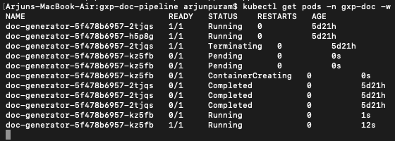

A running pod was forcefully deleted. Kubernetes detected the failure instantly, scheduled a replacement, and the new pod passed health checks in **12 seconds**. The second pod served all traffic during recovery — zero downtime.

### Test 2 — Secrets Rotation
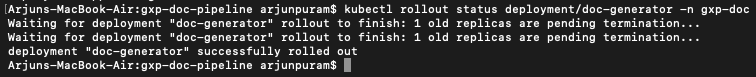

API key rotated in AWS Secrets Manager. Rolling restart deployed new pods that fetched the updated secret on startup — one old pod kept running until the new one was healthy. Zero downtime.

### Test 3 — Full Recovery Verified
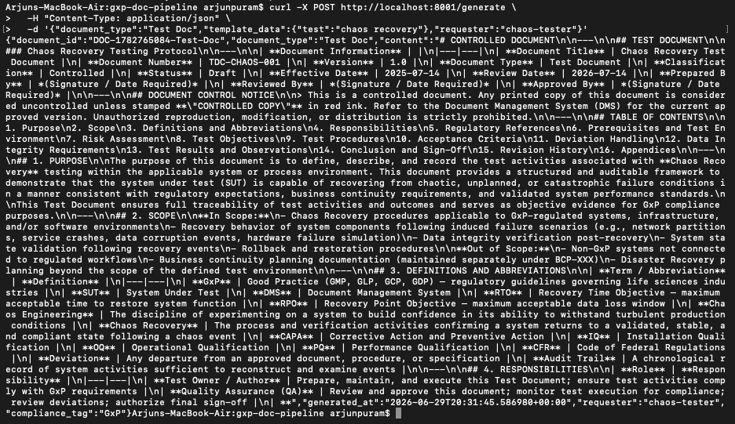

After all chaos tests, the service successfully generated a complete GxP document — proving full system recovery and end-to-end functionality.

---

## Postmortem

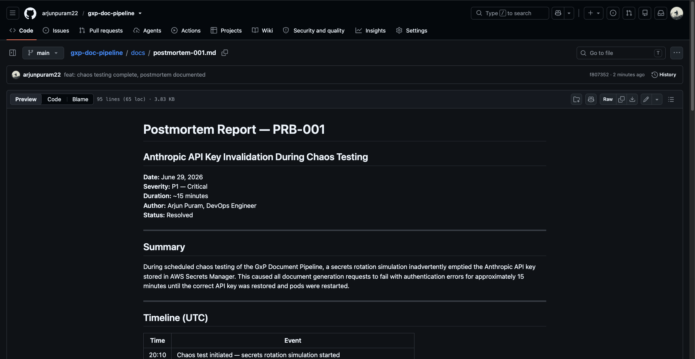

A realistic incident postmortem documenting an API key invalidation during chaos testing — timeline, root cause, impact assessment, action items, and GxP documentation requirements. Written in standard SRE format.

---

## Runbooks

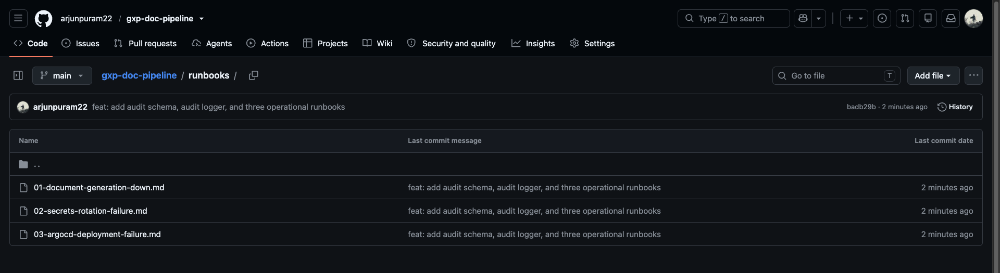

Three operational runbooks for the most critical failure scenarios. Each includes symptoms, step-by-step diagnosis, remediation commands, escalation path, and GxP documentation requirements.

---

## Key Design Decisions

**Why GitOps over direct kubectl deployments?**
In GxP environments every deployment must be auditable and reproducible. GitOps ties every deployment to a Git commit — providing a tamper-evident history of what was deployed, when, and why. Manual kubectl apply in production is a deviation from the validated process.

**Why AWS Secrets Manager over Kubernetes Secrets?**
Kubernetes Secrets are base64 encoded, not encrypted by default, and visible to anyone with cluster access. Secrets Manager values are encrypted, access-controlled by IAM, and support automatic rotation — required for GxP credential management.

**Why two availability zones?**
A pharma company cannot afford downtime during an FDA submission deadline. Spreading nodes across two AZs means a single data center failure cannot take down the service.

**Why non-root containers?**
Running as root inside a container is a security violation in regulated environments. A compromised root container can escape to the host node. Non-root containers with minimal permissions limit blast radius.

**Why immutable image tags?**
GxP requires you to prove exactly what code was running at any point in time. Mutable tags like latest make this impossible — you cannot audit what was actually deployed. Every change gets a new version tag.

---

## Infrastructure Cost

| Resource | Cost |
|---|---|
| EKS Control Plane | $0.10/hour |
| 2x t3.medium nodes | ~$0.083/hour |
| NAT Gateway | ~$0.045/hour |
| **Total running** | **~$0.23/hour (~$5.50/day)** |

Nodes scaled to zero when not in use. terraform destroy tears down all resources completely.

---

## Author

**Arjun Puram**
DevOps / Platform Engineer
[GitHub](https://github.com/arjunpuram22) | [LinkedIn](https://linkedin.com/in/arjunpuram)
